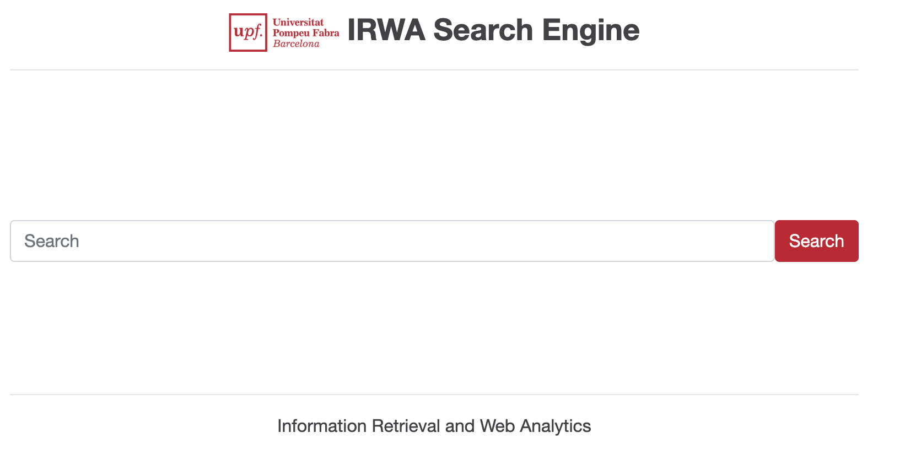

# Information Retrieval and Web Analytics (IRWA) - Final Project template

<table>
  <tr>
    <td style="vertical-align: top;">
      
    </td>
    <td style="vertical-align: top;">
      This repository contains the template code for the IRWA Final Project - Search Engine with Web Analytics.
      The project is implemented using Python and the Flask web framework. It includes a simple web application that allows users to search through a collection of documents and view analytics about their searches.
    </td>
  </tr>
</table>

----
## Project Structure

```
/irwa-search-engine
├── myapp                # Contains the main application logic
├── templates            # Contains HTML templates for the Flask application
├── static               # Contains static assets (images, CSS, JavaScript)
├── data                 # Contains the dataset file (fashion_products_dataset.json)
├── project_progress     # Contains your solutions for Parts 1, 2, and 3 of the project
├── .env                 # Environment variables for configuration (e.g., API keys)
├── .gitignore           # Specifies files and directories to be ignored by Git
├── LICENSE              # License information for the project
├── requirements.txt     # Lists Python package dependencies
├── web_app.py           # Main Flask application
└── README.md            # Project documentation and usage instructions
```


----
# Part 4: User Interface, RAG & Web Analytics
In this final part of the project, we transformed our backend search logic into a fully functional Web Application using Flask.
We focused on three main goals:
1. Usability: Creating a clean interface where users can search, filter by algorithm, and view product details.
2. Intelligence: Integrating a RAG (Retrieval-Augmented Generation) system acting as a "Personal Shopper."
3. Performance: Optimizing the application startup time.

----
### Implementation
#### USER INTERFACE 
1. Optimized Web Application (web_app.py)
We encountered a major efficiency problem in the provided template: it rebuilt the index from scratch every time the server started (taking ~3 minutes).
The Fix: We modified the startup logic to load the pre-computed index (irwa_index.pkl) generated in Part 2.
Result: The application now starts instantly (<1 second) and search results appear immediately.

2. Multi-Algorithm Search
We added a dropdown menu in the UI that allows the user to select the ranking algorithm dynamically:
  * TF-IDF: The baseline method.
  * BM25: Probabilistic ranking (usually better precision).
  * Word2Vec: Semantic search (finding context, not just keywords).
  * Custom: Our own score combining TF-IDF with Product Rating.

3. Analytics Dashboard
We implemented a basic tracking system. We capture:
  * Search Queries: What users are typing.
  * Clicks: Which documents users actually view.
  * Dashboard: A visual representation of the most visited documents.
    
----
----
### File Structure
| File | Description |
|------|--------------|
| **`web_app.py`** | The main Flask server. Handles routing, loading the index, and calling search logic. |
| **`myapp/search/search_engine.py `** | The logic layer. It imports our algorithms from Parts 2/3 and formats results for the UI. |
| **`myapp/generation/rag.py`**| Improvemnets RAG. Contains the Prompt Template and connection to Groq API.|
| **`templates/results.html`**| The results page. We designed "Product Cards" to display images, proces, and discount clearly.|
| **`templates/doc_details.html`** | The product page. Display the full specification table (Seller, Fabric, Patteern). |

----
### How to Run 
####  Prerequisites 
1. Ensure you have generated the index first (Part 2):
```bash
python project_progress/part_2/run_search.py
```
#### Execution
Prrepare and activate virtualenv for the project and run the web server from the root directory:
```bash
python web_app.py
```

The above will start a web server with the application:
```
 * Serving Flask app 'web-app' (lazy loading)
 * Environment: production
   WARNING: This is a development server. Do not use it in a production deployment.
   Use a production WSGI server instead.
 * Debug mode: off
 * Running on http://127.0.0.1:8088/ (Press CTRL+C to quit)
```

Open Web app in your Browser:  
[http://127.0.0.1:8088/](http://127.0.0.1:8088/) or [http://localhost:8088/](http://localhost:8088/)


----
### Prepare virtualenv for the project
In the root of the project folder run to create a virtualenv named `irwa_venv`:
```bash
virtualenv irwa_venv
```

If you list the contents of the project root directory, you will see that it has created a new folder named `irwa_venv` that contains the virtualenv:
```bash
ls -l
```

The next step is to activate your new virtualenv for the project:
```bash
source irwa_venv/bin/activate
```

or for Windows...
```cmd
irwa_venv\Scripts\activate.bat
```

This will load the python virtualenv for the project.

### Installing Flask and other packages in your virtualenv
Make sure you are in the root of the project folder and that your virtualenv is activated (you should see `(irwa_venv)` in your terminal prompt).
And then install all the packages listed in `requirements.txt` with:
```bash
pip install -r requirements.txt
```

If you need to add more packages in the future, you can install them with pip and then update `requirements.txt` with:
```bash
pip freeze > requirements.txt
```

Enjoy!


## Starting the Web App
```bash
python -V
# Make sure we use Python 3

cd search-engine-web-app
python web_app.py
```
The above will start a web server with the application:
```
 * Serving Flask app 'web-app' (lazy loading)
 * Environment: production
   WARNING: This is a development server. Do not use it in a production deployment.
   Use a production WSGI server instead.
 * Debug mode: off
 * Running on http://127.0.0.1:8088/ (Press CTRL+C to quit)
```

Open Web app in your Browser:  
[http://127.0.0.1:8088/](http://127.0.0.1:8088/) or [http://localhost:8088/](http://localhost:8088/)


## Creating your own GitHub repo
After creating the project and code in local computer...

1. Login to GitHub and create a new repo.
2. Go to the root page of your new repo and note the url from the browser.
3. Execute the following locally:
```bash
cd <project root folder>
git init -b main
git add . && git commit -m "initial commit"
git remote add origin <your GitHub repo URL from the browser>
git push -u origin main
```

## Usage: 
0. Put the data file `fashion_products_dataset.json` in the `data` folder. It will be provided to you by the instructor.
1. As for Parts 1, 2, and 3 of the project, please use the `project_progress` folder to store your solutions. Each part should contain `.pdf` file with your report and `.ipynb` (Jupyter Notebook) file with your code for solution and `README.md` with explanation of the content and instructions for results reproduction.
2. For the Part 4, of the project, you should build a web application using Flask that allows users to search through a collection of documents and view analytics about their searches. You should work mailnly in the `web_app.py` file `myapp` and `templates` folders. Feel free to change any code or add new files as needed. The provided code is just a starting point to help you get started quickly.
3. Make sure to update the `.env` file with your Groq API key (can be found [here](https://groq.com/), the free version is more than enough for our purposes) and any other necessary configurations. IMPORTANT: Do not share your `.env` file publicly as it contains sensitive information. It is included in `.gitignore` to prevent accidental commits. (It should never be included in the repos and appear here only for demonstration purposes).
4. Have fun and be creative!

## Attribution:
The project is adapted from the following sources:
- [IRWA Template 2021](https://github.com/irwa-labs/search-engine-web-app)


